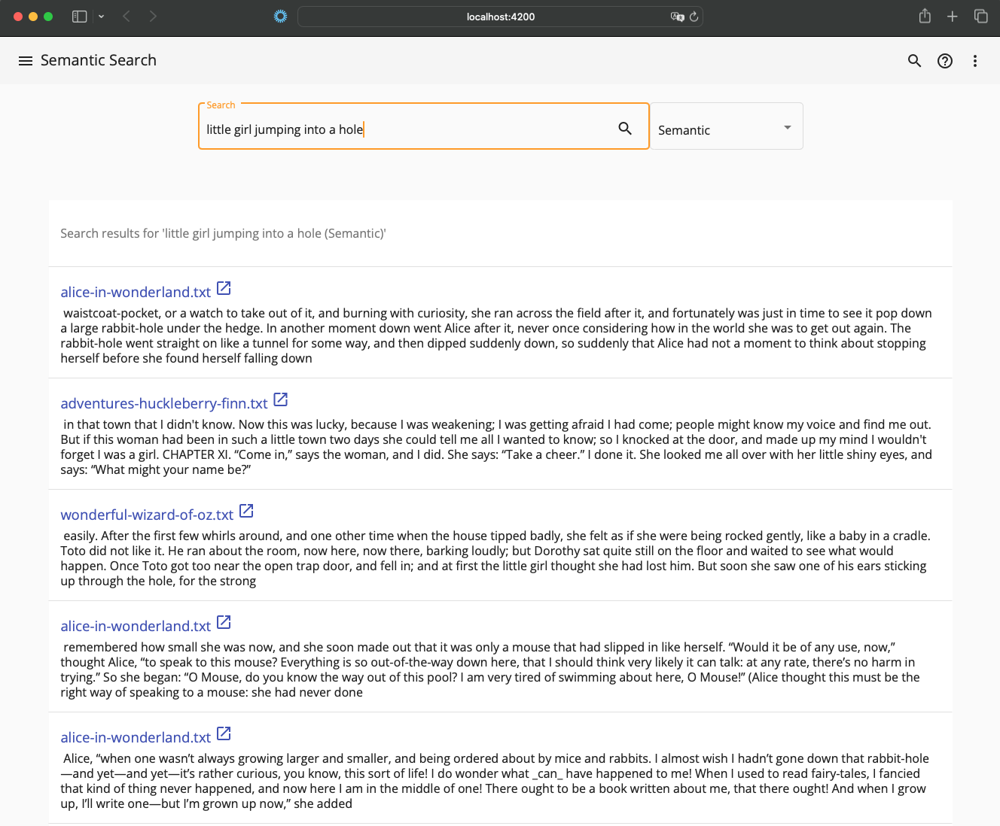

# Alfresco Neural Search UI

## Overview

The **Alfresco Neural Search UI** project provides a user interface extension for Alfresco Content Services (ACS) that integrates advanced neural search capabilities powered by OpenSearch. 

## Prerequisites

Before setting up the Alfresco Neural Search UI extension, ensure you have the following prerequisites:

- Alfresco Content Services (ACS) installed and running
- OpenSearch set up and running
- Node.js 18 and npm installed

## Installation

### Clone the Repository

```bash
git clone https://github.com/aborroy/alfresco-opensearch-neural-search.git
cd alfresco-opensearch-neural-search/neural-search-ui
```

### Install Dependencies

Use npm to install the necessary dependencies:

```bash
npm install
```


## Usage

Once installed and configured, the Neural Search UI will enhance the standard search functionality in Alfresco. Users can perform searches through the new interface, which will provide more relevant and context-aware results.

To run the Neural Search UI in development mode with hot-reloading:

```bash
npm start
```

Access the development server at `http://localhost:4200`



Compare results selecting 'Semantic', 'Keywords' or 'Hybrid' before searching.